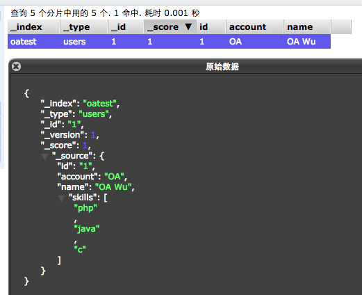
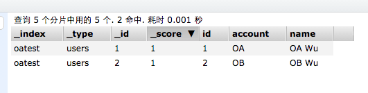

# Welcome To OA's Elastica Search!
OA's Elastica Search。

---

<br/>
## 聲明
本作品授權採用 姓名標示-非商業性 2.0 台灣 (CC BY-NC 2.0 TW) 授權，詳見 [http://creativecommons.org/licenses/by-nc/2.0/tw/](http://creativecommons.org/licenses/by-nc/2.0/tw/)


<br/>
## 簡介
* 這是一套架構於 [Elastica](https://github.com/ruflin/Elastica) Lib 所開發的工具，進階方便的使用物件操作 Elastica Search 資料。
* 相關語法與觀念架構可以查閱 [https://www.elastic.co/](https://www.elastic.co/)


<br/>
## 範例
* 以本資料夾結構為範例，要先引入 `Elastica/ElasticaSearch.php` 檔案後即可使用。
* 每個不同 Type 的資料用以不同的物件管理，本範例將以 **user** 為例說明。
* 檔案 **index.php** 有 CRUD 的使用說明。

### 物件
* 路徑在 `searches/` 下的每個繼承 **ElasticaSearch** 的物件。
* 以 **user** 範例，每個物件必須設定 **primary_key**、**type_name**。
* primary_key 用來指定一個 **field** 作為更新、刪除的查詢依據。
* type_name 則是相對應於 Elastica Search 的 index 下的 type。

```
class User extends ElasticaSearch {
  static $primary_key = 'id';
  static $type_name = 'users';

  public function __construct ($data = array ()) {
    parent::__construct ($data);
  }
}


```

 
### 單筆新增
格式：`Class::create($params);`

* $params - 陣列，存入資料陣列，其 key 為 field 名稱，value 為 field 值。

#### Sample

* 單一資料新增，使用 `create`，並新增成功後回傳一個 **ElasticaSearch** 物件，若是失敗則回傳 **null**。

```
$params = array(
    'id' => 1,
    'account' => 'OA',
    'name' => "OA Wu",
    'age' => 30,
    'skills' => array(
        'php', 'java', 'c'
      )
  );
// 新增一筆資料
$user = User::create($params);

```



### 多筆新增
格式：`Class::createMany($paramsList);`

* $paramsList - 陣列，多筆資料的陣列。

#### Sample

* 多筆新增，使用 `createMany`，成功後回傳 **ElasticaSearch 物件陣列**，若是失敗則回傳**空陣列**。

```
$params1 = array(
    'id' => 1,
    'account' => 'OA',
    'name' => "OA Wu",
    'age' => 20,
    'skills' => array(
        'php', 'java', 'c'
      )
  );
$params2 = array(
    'id' => 2,
    'account' => 'OB',
    'name' => "OB Wu",
    'age' => 30,
    'skills' => array()
  );
// 新增多筆資料
$users = User::createMany(array($params1, $params2));
```


> 若是新增的 primary_key 的資料已經存在，則會覆蓋掉原本的資料。

> ex: 先 create(array ('id' => 1, 'account' => 'OA', 'name' => "OA Wu")); 後，再 create(array ('id' => 1, 'account' => 'OB'));

> 則後者會**取代**掉前者的資料。


### 查詢
格式：`Class::find($unit, $conditions);`

* $unit - 字串，爲回傳格式，有 `one`、`all` 兩種，**one** 回傳單筆物件，**all** 則是物件陣列。
* $conditions - 陣列，查詢條件，分別有 **must**、**limit**、**range**、**offset**、**select**、**should**、**must_not**、**script_fields** 條件設定，細節如下：
	* must - 必須符合條件
	* limit - 回傳長度
	* range - 範圍條件
	* offset - 起始位移點
	* select - 回傳 fields
	* should -  模糊條件
	* must_not - 完全未符合
	* script_fields - script


#### Sample

* 查詢方式使用 **find**，第一參數為 **one**，即回傳條件之下的第一筆**物件**，若無查詢結果則回傳 **null**。
 
```
// 藉由 id 等於 1
$user = User::find('one', array(
    'must' => array('id' => 1)
  ));

echo $user->name; // 印出 OA Wu
```

* 查詢方式使用 **find**，第一參數為 **all**，即回傳條件之下的**物件陣列**，若無查詢結果則回傳**空陣列**。

```
// 藉由 name 相似於字串 Wu
$user = User::find('all', array(
    'should' => array('name' => 'Wu')
  ));
echo count($user); // 印出 2
```

* 多項條件範例。

```
$user = User::find('all', array(
    'must' => array('id' => 1),                                 // id 一定要為 1
    'limit' => 10,                                              // 取前 10 筆
    'range' => array('age' => array('from' => 0, 'to' => 100)), // 設定 age 範圍 0~100
    'offset' => 0,                                              // 起始位移值 0
    'select' => array('id', 'account', 'name'),                 // 取出 id、account、name
    'should' => array('name' => 'Wu'),                          // 如果有 Wu
    'must_not' => array('name' => 'A'),                         // 不能有 A
    'script_fields' => array('var' => array(                    // 新增一個變數，並且使用 script 處理
                                  'script' => "doc['age'].value / 2 + constantVal",
                                  'params' => array(
                                      'constantVal' => 10
                                    )
                                ))
  ));
print_r($user[0]->fields); // 印出第一筆所有欄位資料
```
結果如下：

```
Array
(
    [name] => OA Wu
    [id] => 1
    [account] => OA
    [var] => 20
)
```

### 物件資料更新
格式：`$objext->save();`，儲存並且更新。

#### Sample

```
// 藉由 id 等於 1
$user = User::find('one', array(
    'must' => array('id' => 1)
  ));

$user->account = 'comdan66'; // 設定欄位
$user->save(); // 儲存更新
```

### 單筆資料更新
格式：`Class::update($params);`

* $params - 陣列，依據 primary_key 欄位更新該筆資料，資料陣列，其 key 為 field 名稱，value 為 field 值。

#### Sample

```
// 欲新增的資料
$params = array(
    'id' => 1,
    'account' => 'comdan66',
    'name' => "OA Wu",
    'age' => 30,
    'skills' => array(
        'php', 'java', 'c'
      )
  );

// 依據 primary_key 欄位更新該筆資料
User::update($params);
```


### 多比資料更新
格式：`Class::updateMany($params);`

* $paramsList - 陣列，依據各筆的 primary_key 欄位更新。

#### Sample

```
$params1 = array(
    'id' => 1,
    'account' => 'comdan66',
    'name' => "OA Wu",
    'age' => 20,
    'skills' => array(
        'php', 'java', 'c'
      )
  );
$params2 = array(
    'id' => 2,
    'account' => 'comdan99',
    'name' => "OB Wu",
    'age' => 30,
    'skills' => array()
  );
// 依據各筆資料的 primary_key 欄位更新該筆資料
$users = User::updateMany(array($params1, $params2));
```

### 物件資料刪除
格式：`$objext->delete();`，刪除該筆資料。

#### Sample

```
// 藉由 id 等於 1
$user = User::find('one', array(
    'must' => array('id' => 1)
  ));

$user->delete(); // 刪除
```

### 多筆資料刪除
格式：`Class::deleteMany($ids)`

* $ids - 陣列，primary_key 欄位的陣列。

#### Sample

```
$ids = array(1, 2, 3);
User::deleteMany ($ids); // 依據 id 陣列刪除
```